# 小仙管理后台 — 产品需求文档（PRD）

> **关联文档**：本文档以《钉钉H5集成_开发指南》为需求与架构基准，冲突时以该文档为准。

---

## 【业务背景】

* **统一配置与体验**：一处维护欢迎语、意图改写、工具栏，双端拉取一致、无需发版。
* **可审计、可追溯**：会话上报落库，支持按用户/时间/评价/Skill 等筛选、导出与详情回放。
* **成本与权限可控**：成本监控（趋势与分布）；按角色控制菜单与操作范围。

---

## 【业务相关】

| 字段 | 说明 |
|------|------|
| 需求人 | 江政韬 |
| 需求创建时间 | 2026.03 |

---

## 1. 文档信息

| 项目 | 说明 |
|------|------|
| 文档版本 | 1.0 |
| 更新日期 | 2026-03 |
| 产品/负责人 | 江政韬 |
| 项目名称 | ai-manager-backend（小仙管理后台 / xiaoxian-admin） |
| 关联文档 | [钉钉H5集成_开发指南](../docs/钉钉H5集成_开发指南.md) |

---

## 2. 产品概述

### 2.1 目标用户

| 角色 | 说明 | 典型使用场景 |
|------|------|----------------|
| **管理员（admin）** | 拥有全部菜单与配置权限 | 配置前台欢迎语、意图改写、工具栏与 Skill；管理项目、知识库、用户；使用 Prompt 调试与测评工作台；查看成本与会话审计 |
| **运营人员（operator）** | 可查看数据监控，不可改配置与开发工具 | 成本看板、会话审计、知识库。*首期仅 admin，operator 后续迭代。* |

### 2.2 使用场景

- 登录后默认进入成本看板；调整前台 AI 行为在「前台配置」；分析使用情况在「会话审计」筛选/导出/详情回放；管理员使用「Prompt 调试」「测评工作台」。

### 2.3 产品目标与首期范围

- **目标**：为 PC/移动端前台提供统一配置源与公开拉取接口；接收会话上报并支持审计；为管理员提供成本与配置入口。
- **首期范围**：成本看板、项目档案、知识库、测评工作台按已确认设计建设；用户管理保留入口占位（自建用户表与角色分配后续对接）。首期仅 admin 角色。

### 2.4 与其它项目的关系

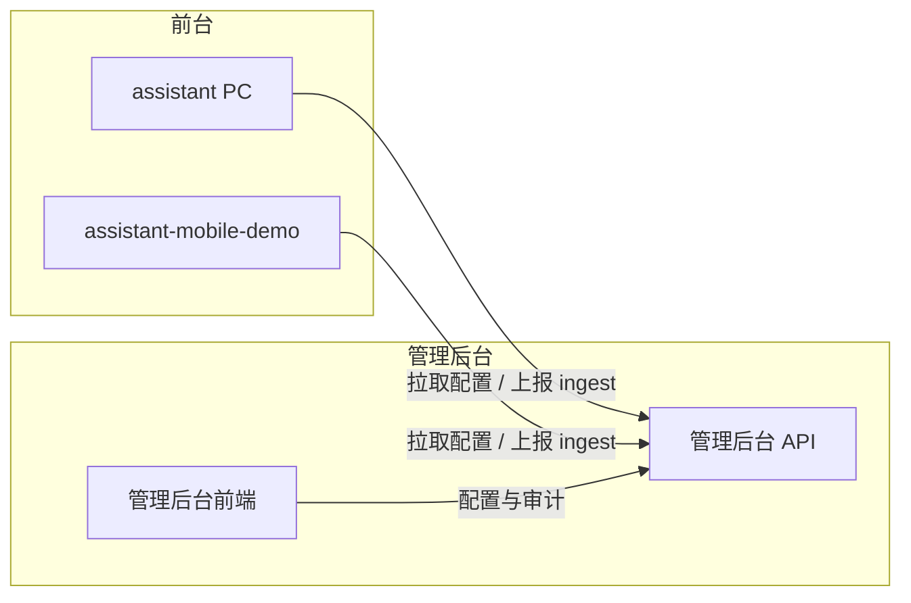

- **前台**：拉取配置、每轮对话结束后上报会话；接口由开发定义。
- **管理后台**：仅与本项目后端（及可选网关）通信，不直接对接主业务或协作系统。

---

## 3. 业务需求

### 3.1 功能入口

| 系统路径 | 路由 | 说明 |
|----------|------|------|
| 管理后台-数据监控-成本看板 | `/cost` | 默认首页（`/` 重定向至此） |
| 管理后台-数据监控-会话审计 | `/sessions` | 会话列表、筛选、导出、详情 |
| 管理后台-系统配置-前台配置 | `/config/assistant` | 欢迎语、意图改写、工具栏 |
| 管理后台-系统配置-Skill 管理 | `/config/skills` | Skill 列表与工具栏联动 |
| 管理后台-系统配置-项目档案 | `/config/projects` | 项目维度配置，首期建设 |
| 管理后台-系统配置-知识库编辑 | `/config/knowledge` | 知识库维护（JSON 录入、发布生效），首期建设 |
| 管理后台-系统配置-用户管理 | `/config/users` | 用户/角色（自建用户表、角色分配），首期保留入口占位 |
| 管理后台-开发工具-Prompt 调试 | `/debug` | 仅 admin |
| 管理后台-开发工具-测评工作台 | `/testbench` | 仅 admin |
| 登录页 | `/login` | 未登录访问受保护路由时跳转 |

#### 各入口与操作截图

以下截图为管理后台 `http://10.10.2.110:3100/` 各入口及实际操作界面（供测试与产品核对）。

**登录页**

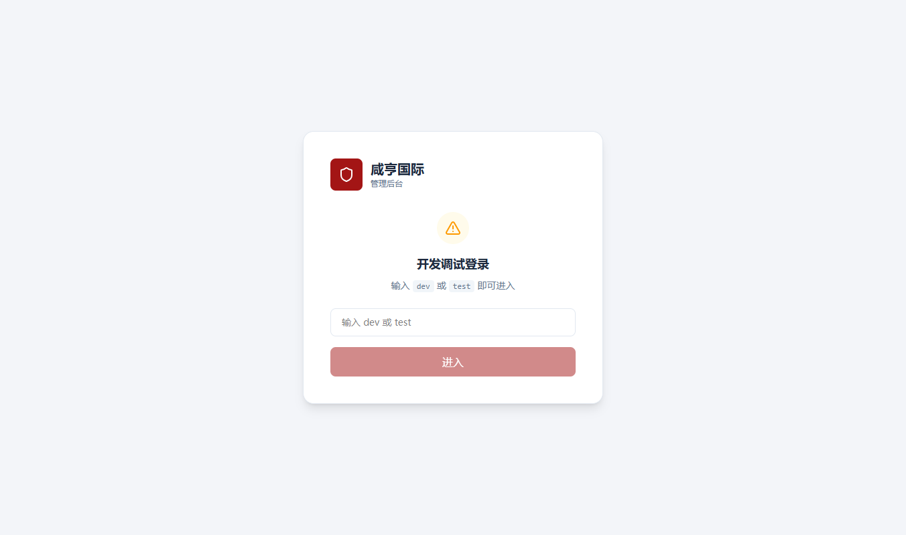

**成本看板**（默认首页 `/cost`）

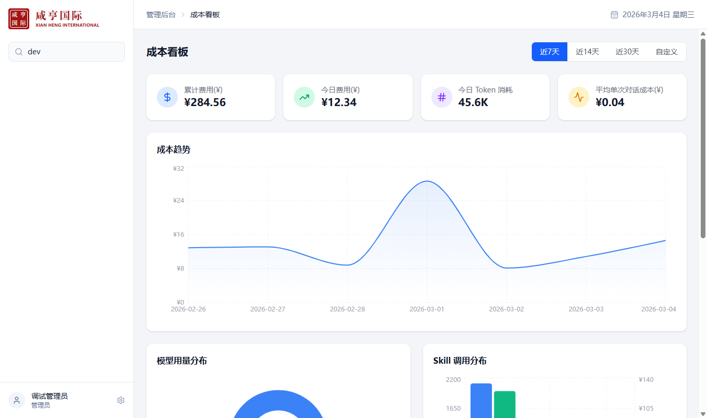

**会话审计**（`/sessions`：列表、筛选、导出、详情）

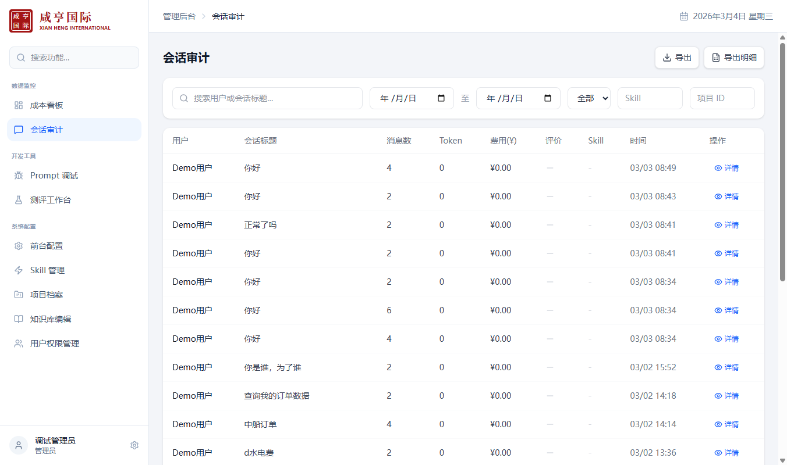

**前台配置**（`/config/assistant`：欢迎语、意图改写、工具栏）

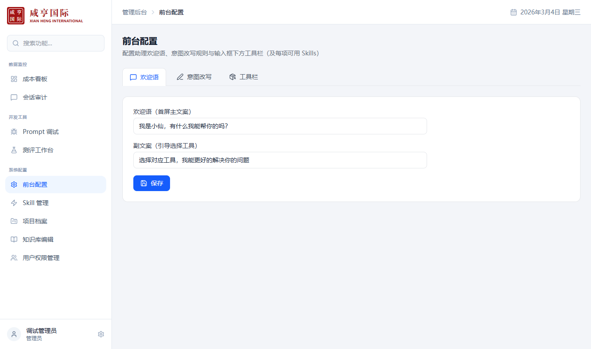

**Skill 管理**（`/config/skills`）

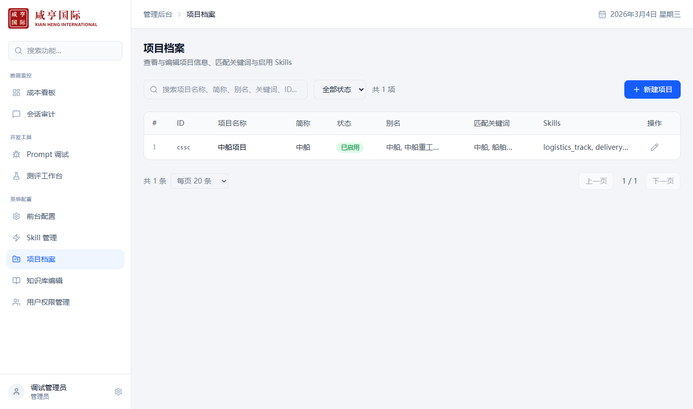

**项目档案**（`/config/projects`）

**知识库编辑**（`/config/knowledge`）

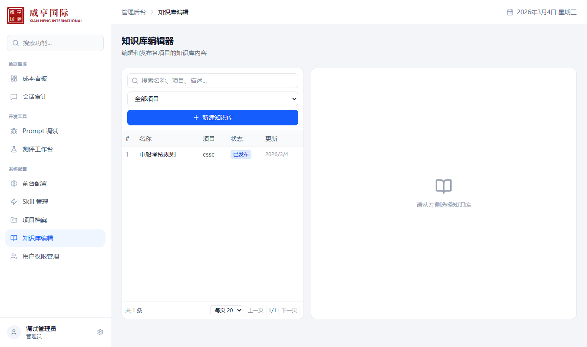

**用户权限管理**（`/config/users`）

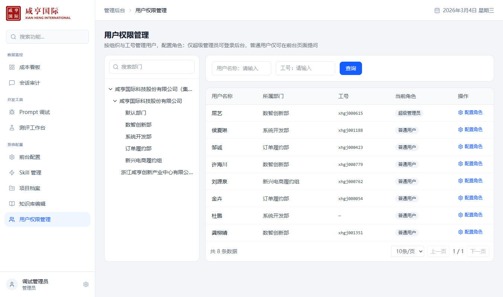

**Prompt 调试**（`/debug`）

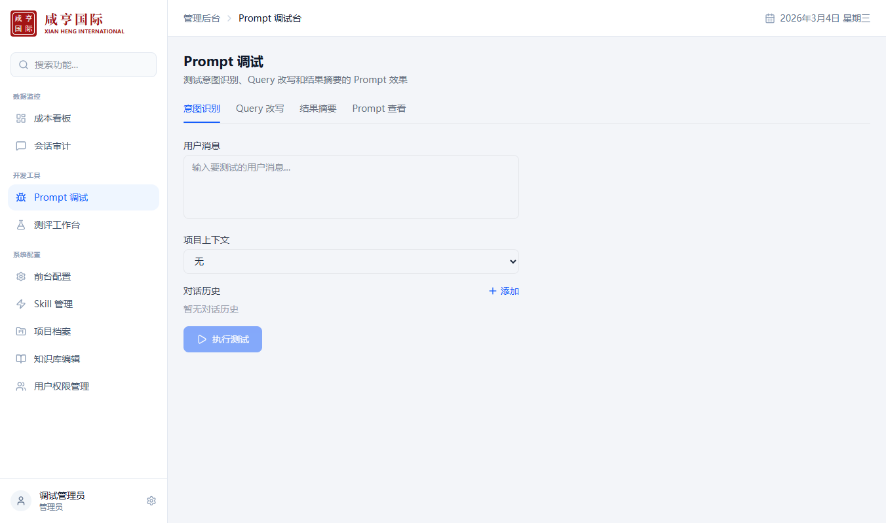

**测评工作台**（`/testbench`）

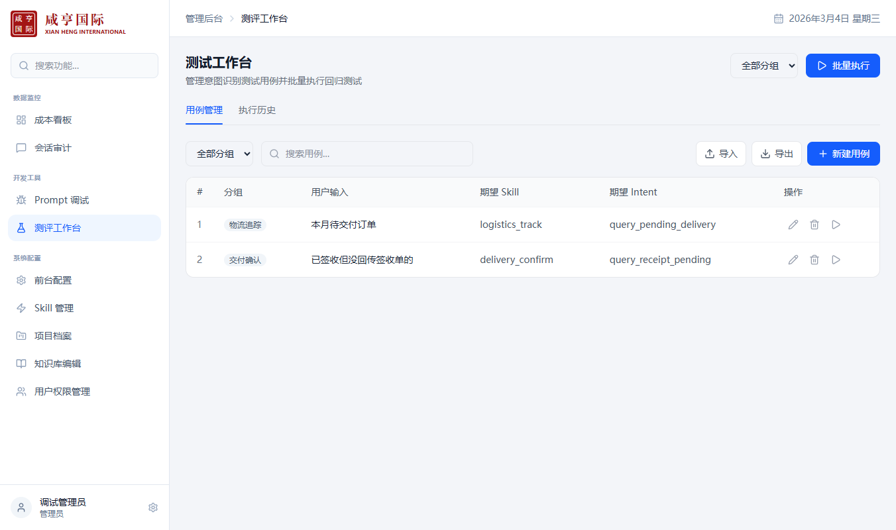

**实际操作示例：会话详情**（从会话审计列表点击某条「详情」进入，左栏对话回放、右栏点击 AI 消息可查看调试信息）

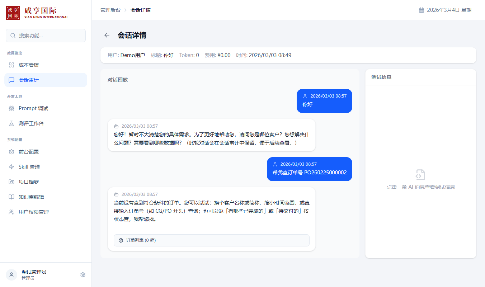

### 3.2 核心业务流程说明

1. **登录与权限**：未登录访问受保护路由跳转 `/login`。开发/联调可用 token（如 dev/test）免钉钉登录；正式环境钉钉单点。登录后按角色展示菜单（admin 全量，operator 仅成本/会话审计/知识库；首期仅 admin）。
2. **配置更新与前台拉取**：管理员在「前台配置」保存欢迎语、意图改写、工具栏后写入存储；前台通过公开接口拉取（无需鉴权），与保存结果一致、无需发版生效。
3. **会话上报与审计**：前台每轮对话结束后上报会话并落库；运营/管理员在「会话审计」按条件筛选、分页、导出列表/明细 CSV，点击详情可回放对话并查看单条消息的 debug（skill、intent、model、tokens、cost 等）。

### 3.3 业务流程图

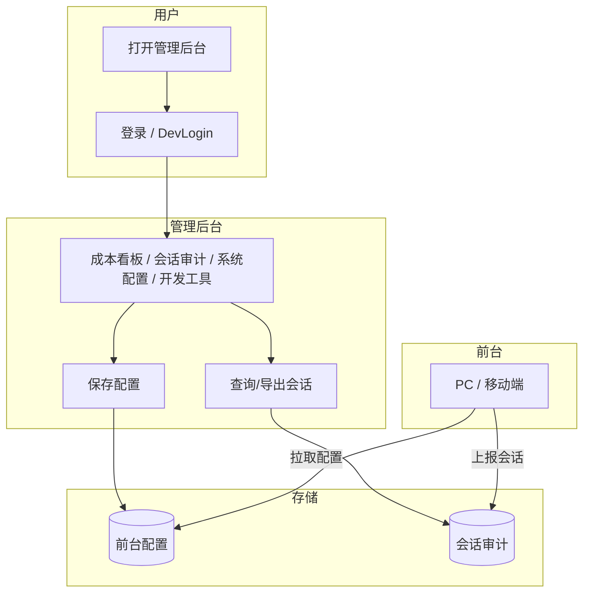

### 3.4 交互时序图

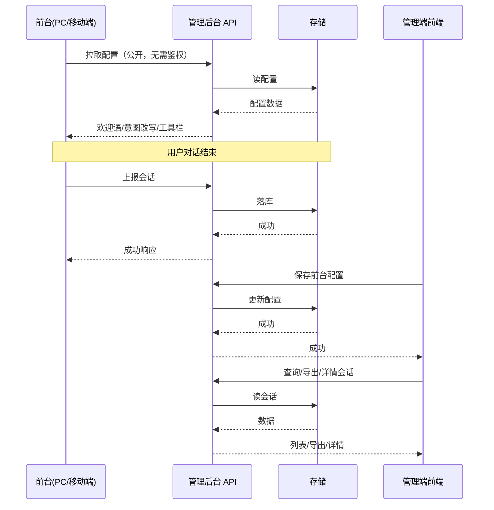

### 3.5 关键环节能力说明

以下能力由管理后台提供，接口路径、请求/响应格式由开发定义。

| 环节 | 能力要求 |
|------|----------|
| 前台拉取配置 | 公开、无需鉴权；返回欢迎语、意图改写规则、工具栏，与「前台配置」保存结果一致。 |
| 会话上报 | 接收对话结束后的上报并落库，至少含会话标识、标题、用户、消息列表及可选 debug/反馈。 |
| 会话列表/导出/详情 | 按条件筛选与分页；按当前筛选导出列表 CSV、明细 CSV；按 ID 查详情（消息回放 + 单条 debug）。 |

### 3.6 前台助理应答业务流程（产品设想）

前台 AI 助理处理用户提问的预期流程；管理后台以意图改写、项目档案、Skill、知识库等配置支撑，且 Skill/知识库可随时在后台补充以支撑迭代。

1. **语义理解与拆解**：LLM 对用户输入做语义理解，拆解意图与关键信息。
2. **意图匹配**：若通过意图规则（如正则）匹配到对应意图 → 进入该意图，触发对应 Skill 与知识库完成回答；否则进入澄清。
3. **澄清**：向用户进一步澄清，话术由 LLM 自行发挥；记录澄清轮次。若澄清中能匹配意图则回到步骤 2 完成回答。
4. **兜底**：连续三轮澄清仍无法得到可匹配问题 → 回复「暂时无法处理」类话术，结束本轮。
5. **能力扩展**：Skill 与知识库在管理后台维护，可随时新增/编辑/发布，无需改代码即可扩展。

**流程图：**

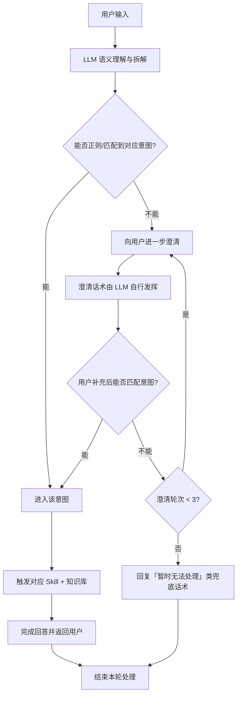

**与管理后台的对应关系：**

| 流程环节       | 管理后台支撑                         |
|----------------|--------------------------------------|
| 意图匹配       | 前台配置-意图改写规则；项目档案（名称→projectId→意图/Skill） |
| 触发 Skill     | 前台配置-工具栏（skillIds）；Skill 管理 |
| 触发知识库     | 知识库编辑（发布后生效）             |
| 能力扩展       | 随时在 Skill 管理、知识库编辑中补充与发布 |

---

## 4. 系统架构与数据流

- **请求关系**：管理后台前端请求本项后端；会话与配置的数据流见 3.2、3.5。技术选型、接口与存储实现由开发定义。
- **存储**：会话审计需支持落库、条件查询、分页、导出、详情；前台配置需支持读（公开拉取 + 管理端）、写（管理端保存）。存储介质可后续扩展切换。

---

## 5. 功能清单与说明

> 以下各模块均包含：**模块介绍**（做什么、解决什么问题）、**预期效果**（希望达成的业务/用户价值），以及**功能清单**（具体功能与开发要点）。

---

### 5.1 鉴权与权限

**模块介绍**  
控制准入与可见范围：谁可进、可见哪些菜单；避免非授权接触配置与敏感数据；开发/联调支持免钉钉登录。

**预期效果**  
正式环境钉钉登录，admin 全权限、operator 仅数据与知识库；联调期 DevLogin 不阻塞进度。

| 功能 | 用途 | 验收要点（测试可核对） |
|------|------|------------------------|
| DevLogin | 开发/联调时免钉钉登录 | 在登录页输入约定 token（如 dev/test）可完成登录并进入后台；请求管理端时携带鉴权信息；当前用户身份/角色可被正确识别（如 admin）。正式环境改为钉钉单点登录。实现方式由开发定义。 |
| 角色与菜单 | 按 admin/operator 控制可见菜单 | admin 可见：数据监控（成本、会话审计）、开发工具（Prompt 调试、测评工作台）、系统配置（前台配置、Skill、项目档案、知识库、用户管理）。operator 可见：成本、会话审计、知识库。首期仅 admin。 |
| 未登录跳转 | 未登录时进入登录页 | 未登录状态下访问需鉴权页面时，自动跳转至登录页；登录成功后可按角色访问对应菜单。 |

### 5.2 数据监控

**模块介绍**  
提供成本与使用情况的可视化与可追溯：成本看板（概览与分布）、会话审计（列表、筛选、导出、详情回放），数据来自前台上报落库。

**预期效果**  
成本看板：中间服务实时记录 + 阿里云价目表换算成本，展示总成本/趋势/分布/排名。会话审计：按用户/时间/评价/Skill 等筛选与导出，详情可回放对话并查看单条 debug。

| 功能 | 用途 | 验收要点（测试可核对） |
|------|------|------------------------|
| 成本看板 `/cost` | 成本概览、趋势、模型/技能/用户分布与排名 | 首期仅上述指标，无额外筛选/下钻。数据来自中间服务实时记录；需补充阿里云价目表，按 token 计算成本。计费与《钉钉H5集成_开发指南》对齐。 |
| 会话审计列表 `/sessions` | 按条件筛选、分页查看会话列表 | 支持关键词、日期、评价、Skill、项目等筛选与分页；列表含用户、标题、消息数、Token、费用、评价、Skill、时间等。 |
| 导出列表 | 按当前筛选导出会话列表 CSV | 与当前筛选一致；CSV、文件名含时间戳、支持中文（如 UTF-8 BOM）；单次上限见非功能需求。 |
| 导出明细 | 按当前筛选导出会话+每条消息一行 | 与当前筛选一致；每条消息一行，含会话与消息维度信息。 |
| 会话详情 `/sessions/:id` | 回放对话并查看调试信息 | 左栏对话回放（用户/助理消息），右栏点击助理消息展示该条 debug（skill、intent、model、tokens、cost 等）。 |

### 5.3 系统配置

**模块介绍**  
统一维护前台展示与响应能力（欢迎语、意图改写、工具栏）及项目、知识库、用户等支撑数据；前台拉取即生效、无需发版。

**预期效果**  
前台配置一处修改、双端一致；Skill 与工具栏联动可维护可扩展；项目档案与知识库首期建设；用户管理首期占位、后续对接自建用户表与角色。

| 功能 | 用途 | 验收要点（测试可核对） |
|------|------|------------------------|
| 前台配置 `/config/assistant` | 欢迎语、意图改写、工具栏（含 skillIds） | 欢迎语：主/副文案保存后前台拉取一致。意图改写：规则列表（匹配模式、替换、启用），前台发消息前应用。工具栏：工具项与前台输入框下按钮一一对应，保存即生效。 |
| Skill 管理 `/config/skills` | Skill 列表与启用状态 | 与「前台配置-工具栏」skillIds 联动（如从工具栏聚合）；工具栏新增/编辑时可选 skillIds。无独立持久化时以工具栏聚合为准。 |
| 项目档案 `/config/projects` | 项目维度配置（projectId 等） | 列表 + 详情 + 新增/编辑/停用。语义解析→项目名称→projectId→触发对应 Skill 与知识库。见文末补充说明。 |
| 知识库编辑 `/config/knowledge` | 知识库维护，供 Skill/检索 | 首期 JSON 格式，文档经线下处理后录入；发布后生效。见文末补充说明。 |
| 用户管理 `/config/users` | 用户/角色 | 角色分配/变更；用户信息从自建用户表获取、不管理本身信息。首期入口占位，后续对接。见文末补充说明。 |

### 5.4 开发工具

**模块介绍**  
仅管理员可见：Prompt 调试（单次/少量轮次验证）、测评工作台（批量用例执行与效果评估）。

**预期效果**  
发布前快速验证 Prompt 与模型；用例外部导入后即可测评，展示通过率/每条结果/差异/耗时，支持历史与两次对比。

| 功能 | 用途 | 验收要点（测试可核对） |
|------|------|------------------------|
| Prompt 调试 `/debug` | 调试 Prompt 与模型调用 | 仅 admin；单次或少量轮次模型调用与 Prompt 验证。 |
| 测评工作台 `/testbench` | 测评用例与效果评估 | 仅 admin。用例外部导入（输入、期望回复、期望 Skill、评分规则）；导入后可触发测评；展示通过率、每条通过/失败、差异、耗时；支持历史与两次测评对比。见文末补充说明。 |

---

## 6. 验收标准

各模块验收以**第 5 章功能清单中的验收要点**为准，以下为跨模块或易遗漏项：

| 模块 | 验收要点摘要 |
|------|--------------|
| 鉴权与权限 | 约定 token 可登录；admin 全菜单、operator 仅成本/会话审计/知识库（首期仅 admin）；未登录跳转登录页。 |
| 会话审计 | 筛选/分页/导出与当前筛选一致；详情页左栏回放、右栏单条 debug；新上报会话可见。 |
| 前台配置 | 欢迎语/意图改写/工具栏保存后前台拉取一致、发消息前规则生效、工具按钮一致。 |
| Skill 与配置联动 | 工具栏 skillIds 在 Skill 管理中可聚合展示，行为符合「来自工具栏聚合」设计。 |
| 存储与扩展 | 会话与配置可持久化与读取；可切换存储而不影响前端能力。 |
| 成本看板 / 项目档案 / 知识库 / 用户管理 / 测评工作台 | 见 5.2～5.4 对应行及文末「补充说明」。 |

---

## 7. 测试用例

| 用例编号 | 模块 | 前置条件 | 步骤 | 预期结果 | 优先级 |
|----------|------|----------|------|----------|--------|
| TC-B-01 | 鉴权 | 未登录 | 打开任意受保护路由 | 跳转至 `/login` | P0 |
| TC-B-02 | 鉴权 | 无 | 在登录页输入 token `dev` 或 `test` 并提交 | 跳转至后台，默认进入 `/cost`，可访问所有 admin 菜单 | P0 |
| TC-B-03 | 权限 | 以 admin 登录 | 查看侧边栏 | 可见「数据监控」「开发工具」「系统配置」下全部菜单（含 Prompt 调试、测评工作台、前台配置、Skill、项目、用户） | P0 |
| TC-B-04 | 权限 | 以 operator 登录（若实现） | 查看侧边栏 | 不可见「开发工具」及「前台配置」「Skill」「项目」「用户」；可见成本、会话审计、知识库。*首期仅 admin，本用例后续迭代执行。* | P1 |
| TC-B-05 | 会话审计 | 后台已运行，前台已上报至少一条会话 | 进入「会话审计」，不设筛选 | 列表展示会话，含用户、标题、消息数、Token、费用、评价、Skill、时间 | P0 |
| TC-B-06 | 会话审计 | 列表有数据 | 设置关键词、日期范围、评价后点击查询 | 列表与分页按筛选条件刷新 | P0 |
| TC-B-07 | 会话审计 | 列表有数据 | 点击「导出列表」 | 下载 CSV，表头为：用户、会话标题、消息数、Token、费用(¥)、评价、Skill、时间；内容与当前筛选一致 | P0 |
| TC-B-08 | 会话审计 | 列表有数据 | 点击「导出明细」 | 下载 CSV，含会话维度与每条消息一行 | P0 |
| TC-B-09 | 会话审计 | 列表有数据 | 点击某条「详情」 | 进入详情页，左栏为对话回放，右栏点击助理消息可展示该条 debug 信息 | P0 |
| TC-B-10 | 前台配置 | 已登录 admin | 进入「前台配置」→ 欢迎语，修改主文案与副文案并保存 | 保存成功；前台拉取配置后展示与编辑结果一致 | P0 |
| TC-B-11 | 前台配置 | 已登录 admin | 进入「前台配置」→ 意图改写，新增一条规则（匹配模式、替换内容、启用）并保存 | 保存成功；前台发消息前应用该规则后文案为改写结果 | P0 |
| TC-B-12 | 前台配置 | 已登录 admin | 进入「前台配置」→ 工具栏，修改某工具项文案或 skillIds 并保存 | 保存成功；前台拉取配置后工具栏展示与编辑一致 | P0 |
| TC-B-13 | Skill 与配置 | 已配置工具栏含多 skillIds | 进入「Skill 管理」查看列表 | 列表为从工具栏配置聚合的 Skill，与 toolbar 中 skillIds 一致 | P1 |

---

## 8. 非功能需求

| 类型 | 说明 |
|------|------|
| 安全 | 正式环境鉴权改为钉钉单点；已有钉钉应用 ID，回调与鉴权方式参见《钉钉统一身份认证》或内部文档。仅前台拉取配置的接口为公开且无需鉴权，管理端增删改查等操作均需鉴权。 |
| 兼容性 | 管理后台为 PC 浏览器使用；需支持 Chrome/Edge 等主流浏览器。 |
| 性能 | 导出列表/明细时单次最多 50000 条，避免超时；大列表分页加载。 |

---

## 9. 附录

### 9.1 能力清单

管理后台需具备：鉴权（身份与角色）；成本看板（中间服务 + 阿里云价目表 + 总成本/趋势/分布/排名）；会话审计（上报落库、筛选分页、导出列表/明细、详情回放与 debug）；前台配置（管理端读写、前台公开拉取，含欢迎语/意图改写/工具栏）；Skill（与工具栏 skillIds 一致或聚合）；项目档案（列表/详情/增删改停用，与 projectId/Skill/知识库联动）；知识库（JSON 录入、发布生效）；用户管理（自建用户表、角色分配，首期占位）；测评工作台（外部导入用例、触发测评、通过率/每条结果/历史与对比）。接口与字段由开发定义。

### 9.2 前台配置业务含义

欢迎语（主/副文案）、意图改写规则（匹配模式、替换内容、启用；发消息前改写）、工具栏（工具项与 skillIds，与前台输入框下按钮一一对应）。字段名由开发定义。

---

## 补充说明（已确认）

| 项 | 结论 |
|----|------|
| 需求人 / 负责人 | 江政韬；需求创建时间 2026.03 |
| 成本看板 | 中间服务实时记录；补充阿里云价目表按 token 计算成本；计费与《钉钉H5集成_开发指南》对齐 |
| 项目档案 | 列表+详情+新增/编辑/停用；语义解析→项目名称→projectId→Skill/知识库；首期建设 |
| 知识库 | JSON、线下处理后录入；发布后生效；首期建设 |
| 用户管理 | 自建用户表、角色分配/变更、不管理用户本身信息；首期入口占位 |
| 测评工作台 | 外部导入用例（输入、期望回复、期望 Skill、评分规则）；导入后可触发；通过率/每条/差异/耗时、历史与两次对比 |
| 角色范围 | 首期仅 admin，operator 后续迭代 |
| 钉钉鉴权 | 已有钉钉应用 ID，参见《钉钉统一身份认证》等 |
| 会话 ingest / 异常与监控 | 请求体字段以接口文档为准；暂无额外监控，单次导出上限 50000 条已约定 |

---

*文档结束。*
