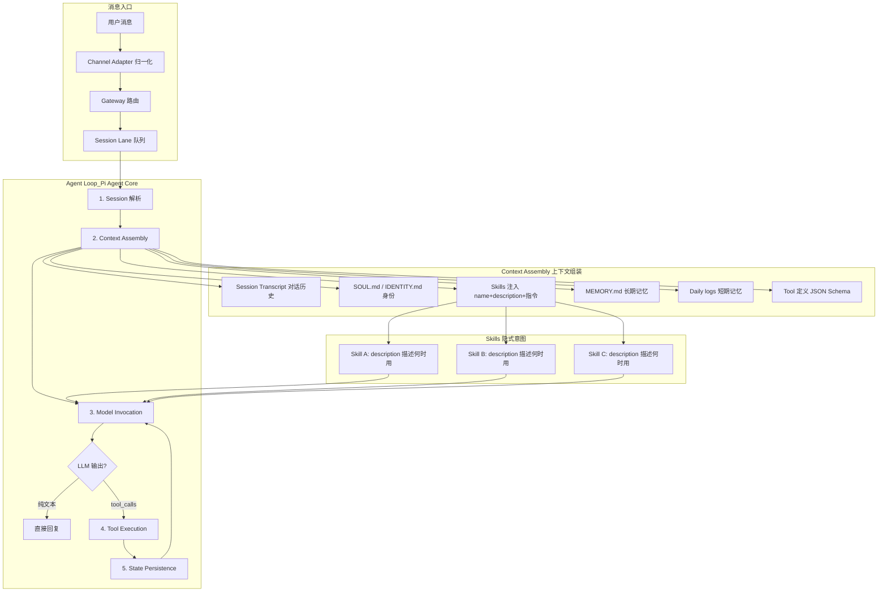
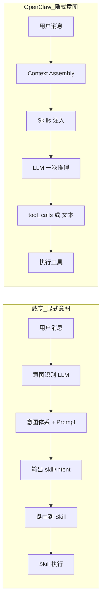

# OpenClaw 如何完成意图识别与路由 — 拆解说明

## 一、核心差异：隐式 vs 显式

| 维度 | 咸亨后台（我们） | OpenClaw |
|------|------------------|----------|
| **意图定义** | 显式：在后台维护意图体系（名称、示例、skillIds） | 隐式：通过 Skill 的 `description` 让 LLM 自行判断 |
| **路由方式** | 先识别意图 → 再路由到 Skill | LLM 直接决定调用哪个工具，无单独「意图识别」步骤 |
| **多轮/切换** | 独立规则配置（多轮追问、意图切换） | 由 LLM 在对话中自然处理 |
| **Prompt** | 意图识别 Prompt + Skill 调用 Prompt 分离 | 统一系统 Prompt，工具定义注入其中 |

---

## 二、OpenClaw 的运作流程



---

## 三、OpenClaw 的「意图」如何体现

### 1. 不单独做意图识别

OpenClaw **没有**独立的意图识别步骤，而是：

- 把所有 Skill 的 `name`、`description`、Markdown 正文指令注入到系统 Prompt
- LLM 在一次推理中同时完成：理解用户 + 选择工具 + 生成回复

### 2. Skill 的 description 即「隐式意图」

```yaml
# SKILL.md frontmatter 示例
---
name: image-gen
description: Generate or edit images using a multimodal model
user-invocable: true
---
```

- `description` 告诉 LLM：「当用户要生成/编辑图片时，用这个 Skill」
- 正文中的「Use when」「Do NOT use」进一步约束触发条件
- **无需**单独维护「意图 → Skill」映射表

### 3. 工具调用 = 路由结果

```
用户: "帮我生成一张日落图"
    ↓
LLM 看到: [image-gen: Generate or edit images...] [read] [write] [exec] ...
    ↓
LLM 输出: tool_calls: [{ name: "image-gen 相关工具", input: {...} }]
    ↓
执行工具 → 结果回填 → LLM 继续或结束
```

---

## 四、OpenClaw Agent Loop 五步详解

| 步骤 | 作用 | 与意图的关系 |
|------|------|--------------|
| **1. Session 解析** | 加载对话历史、确定 session key | 提供多轮上下文 |
| **2. Context Assembly** | 组装 Prompt：历史 + 身份 + Skills + 记忆 + 工具定义 | Skills 的 description 在此注入，相当于「意图候选」 |
| **3. Model Invocation** | 调用 LLM，流式返回 | LLM 隐式完成意图理解 + 工具选择 |
| **4. Tool Execution** | 执行 LLM 请求的工具 | 相当于我们的「路由到 Skill 并调用」 |
| **5. State Persistence** | 写入 JSONL、更新记忆 | 为下一轮提供上下文 |

---

## 五、多轮与意图切换在 OpenClaw 中的处理

| 场景 | 咸亨后台 | OpenClaw |
|------|----------|----------|
| **用户表达不清** | 多轮规则 → 生成追问 | LLM 根据上下文自行决定是否追问 |
| **用户切换话题** | 意图切换规则 → 重置上下文 | 对话历史自然体现，LLM 可识别；`/reset` 可手动清空 |
| **复杂多步任务** | Plan 分解 + Action 执行 | Agent Loop 天然支持：LLM 多次 tool_calls，循环直到输出最终回复 |

---

## 六、OpenClaw 的 Skills 加载与优先级

```
Bundled (内置) → Managed (~/.openclaw/skills/) → Workspace (项目/skills/)
    低优先级 ←———————————————————————————————→ 高优先级
```

- 同名 Skill 高优先级覆盖低优先级
- 通过 `requires`（bins、env、config）控制是否加载，不满足则跳过
- 每个 eligible Skill 都会占用系统 Prompt token

---

## 七、两种方案对比



| 优势 | 咸亨显式 | OpenClaw 隐式 |
|------|----------|---------------|
| 意图可审计、可配置 | ✅ | ❌ 依赖 LLM 理解 |
| 大批量意图维护 | 需导入导出等工具 | 改 description 即可 |
| 多轮/切换可控 | ✅ 规则明确 | 依赖模型能力 |
| 实现复杂度 | 较高（多一步意图识别） | 较低（一步到位） |
| Token 消耗 | 意图识别 + Skill 调用可能分两次 | 通常一次，但 Prompt 更长 |

---

## 八、可借鉴的 OpenClaw 设计

1. **Skill description 即意图**：用高质量 description 替代部分显式意图，减少维护量  
2. **Markdown 指令**：在 Skill 正文写清「Use when / Do NOT use」，相当于把规则写进 Prompt  
3. **Agent Loop 一体化**：意图理解与工具调用在一次推理中完成，减少中间层  
4. **Gating 机制**：通过 `requires` 控制 Skill 加载，避免无效工具占用 token  

---

## 九、参考资料

- [OpenClaw Architecture Deep Dive](https://enricopiovano.com/blog/openclaw-architecture-deep-dive)
- [OpenClaw Agent Loop](https://docs.clawd.bot/concepts/agent-loop)
- [OpenClaw Skills 机制总结](https://www.cnblogs.com/sing1ee/p/19685515/openclaw-skills)
