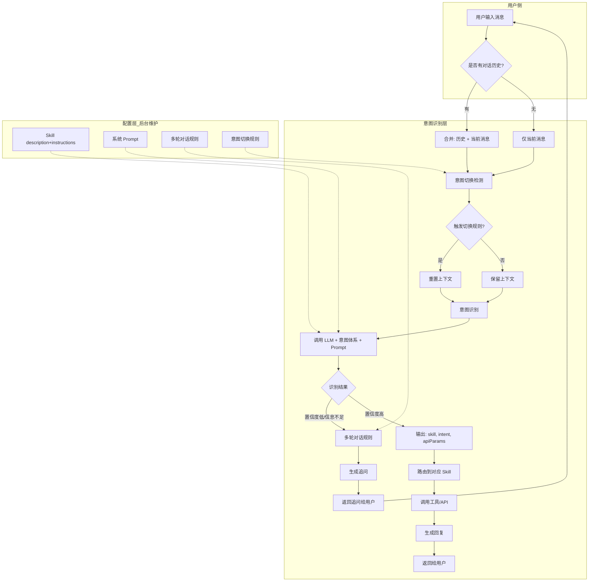
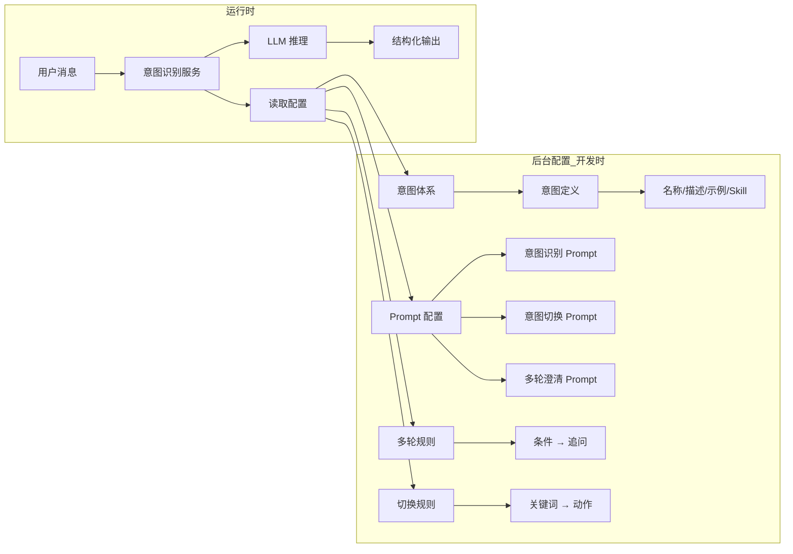
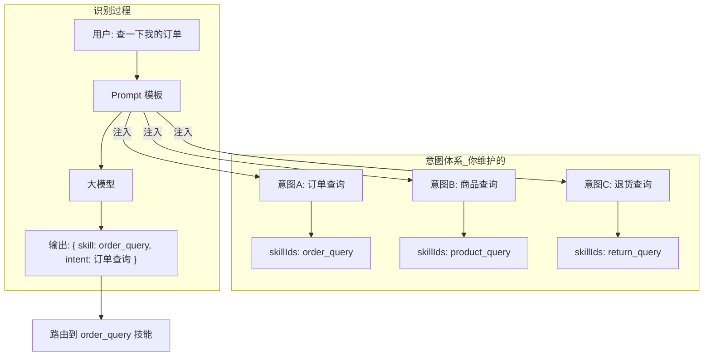
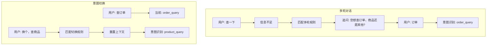

# 意图识别层 - 运作流程图（OpenClaw 风格重构后）

> 重构说明：意图由 Skill 的 description + instructions 隐式定义，LLM 根据注入的 Skill 列表一次推理完成工具选择。

## 一、整体流程

---

## 二、各环节说明

| 环节 | 输入 | 输出 | 配置来源 |
|------|------|------|----------|
| **意图切换检测** | 当前消息 + 历史 | 是否切换、是否重置上下文 | 意图切换规则（触发关键词） |
| **意图识别** | 消息（含历史） | skill、intent、apiParams、confidence | 意图体系、Prompt 配置 |
| **多轮对话** | 识别结果（低置信度） | 追问文案 | 多轮对话规则 |
| **Skill 路由** | skill ID | 具体工具调用 | 意图体系（intent → skillIds） |

---

## 三、配置与运行时的关系

---

## 四、意图定义如何参与识别

**要点**：意图体系中的「名称、描述、示例」会被拼进 Prompt，供大模型参考，从而输出对应的 skill 和 intent。

---

## 五、多轮对话与意图切换

---

## 六、如何查看流程图

- **VS Code**：安装 Mermaid 插件，在预览中查看
- **在线**：复制 Mermaid 代码到 [mermaid.live](https://mermaid.live) 查看或导出图片
